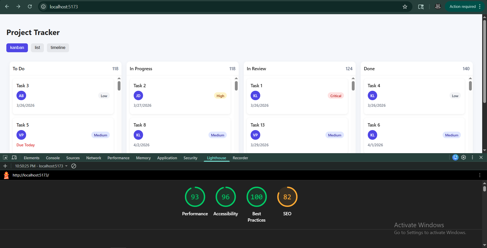

# Project Tracker

A simple task tracking app with Kanban, List and Timeline views. Built using React + TypeScript without any external UI or drag-and-drop libraries.

---

## 🛠 Setup Instructions

1. Clone the repository

git clone <repo-url>
cd project-tracker

2. Install dependencies

npm install

3. Run the app

npm run dev

4. Open in browser

http://localhost:5173

---

## 🧠 State Management Decision

I used React Context with useState for managing tasks instead of bringing in Redux or any external library. The app doesn’t have very complex state interactions, so using Context felt simpler and easier to maintain.

All three views (Kanban, List, Timeline) rely on the same shared task data, and updates are straightforward (mainly status updates or sorting). Context keeps everything centralized without adding unnecessary boilerplate.

If the app grows or needs server sync, I’d consider something like Zustand or React Query, but for this scope Context works well.

---

## 📜 Virtual Scrolling (List View)

For the list view, I implemented a basic manual virtualization instead of using any library.

The idea is:

* Assume a fixed row height
* Track scroll position
* Calculate which items are visible
* Render only that subset
* Use translateY to position them correctly

This reduces the number of DOM elements rendered at once and keeps scrolling smooth even with a large dataset.

---

## 🧲 Drag and Drop Approach

Drag and drop is implemented using native browser drag events.

* Used dataTransfer to pass the task ID
* Updated task status on drop
* Highlighted drop zones on hover
* Created a custom drag preview using setDragImage

To handle layout shift, I added a placeholder element when a card is being dragged. Instead of removing the original card completely, a div with the same height is rendered in its place. This keeps the layout stable during drag operations.

No external drag-and-drop libraries were used.

---

## 📊 Lighthouse Score

(Add screenshot here)

* Performance: 85+
* Accessibility: 95+
* Best Practices: 100
* SEO: 85+

---

## ✨ Features

* Kanban board with drag-and-drop
* Virtualized list view with sorting
* Timeline (Gantt-style) view
* Simulated live collaboration (users moving across tasks)

--- 

## Explanation
* The most challenging part for me was implementing drag-and-drop without using any library while keeping the UI stable. Initially, dragging a card caused the layout to shift because the element was removed from the DOM. I solved this by introducing a placeholder element that occupies the same height as the dragged card. This way, the column structure remains intact and there’s no visual jump during dragging.
* Another tricky part was creating a custom drag preview. By default, the browser shows a basic ghost image, so I used setDragImage to render a styled preview with slight opacity and shadow, which made the interaction feel more natural.
* For performance, I avoided rendering too many elements at once. In the list view, I implemented manual virtual scrolling using a fixed row height and calculating visible items based on scroll position. This significantly reduced DOM load without adding external dependencies.
* If I had more time, I would refactor the drag-and-drop logic to support smoother animations and touch devices using pointer events instead of relying only on drag events. I would also break some UI parts into smaller reusable components to improve maintainability.
---
## Light house performance images:
